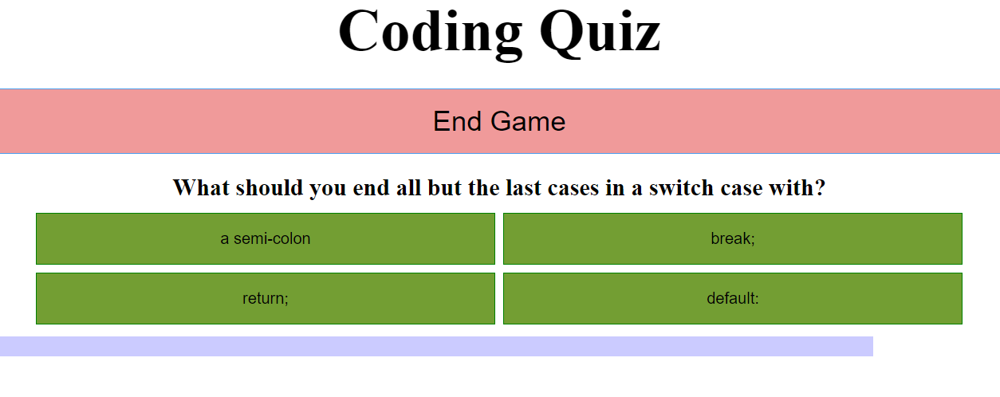

# Code Quiz
application deployed at https://palminski.github.io/code-quiz-rabit/

## Description
Clicking the Start Game button will cause a question to display and answers to appear upon the green buttons. Clicking the button again (now End Game) will result in an imediate game over. Selecting the correct response will bring up the next question while selecting an incorrect one will cause the button to turn red and lower the ammount of remaining time (which is displayed by the light blue bar at the bottom of the screen). The time bar running out or correctly answering all questions will replace the content on the page with an end game screen that will display the players score (based on their remaining time) as well as a high score table which has results from local storage. If the player is so inclined they can enter their initials on this screen and save their score to the table (but only if it is higher than a score already on it, otherwise the submit score form will no appear). Finally, clicking on the return button will send them back to the main page and allow for another play.
## Notes
The assignment said when a question was answered to advance to the next question. I took this to mean that it should advance only on correct answers, otherwise depending on the length of the timer and ammount of time reducted as a penalty you could just skip to the end and still get a score. Were I to impliment it the other way however it could be accomplished by simply increasing the questionIndex variable by one regardless of if the question was answered correctly or not
